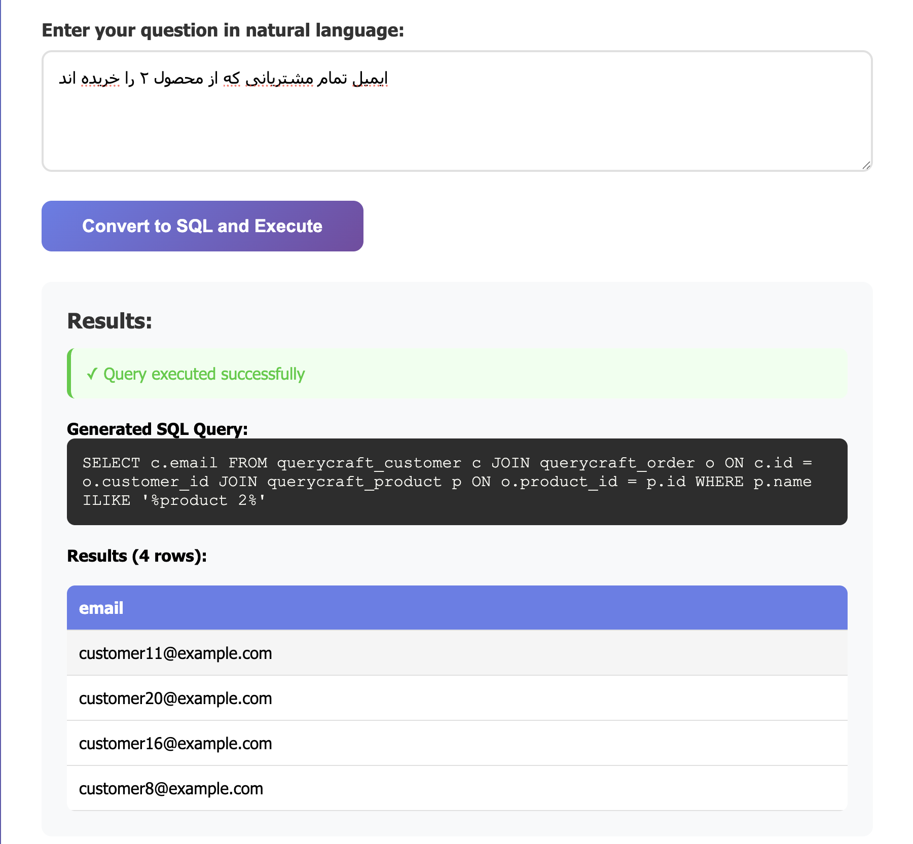

# QueryCraft 🔍

A Django web application that converts natural language questions to SQL queries using an AI Agent
and extracts results from the database.




## Architecture

The project uses Docker Compose with deployment profiles:

### Services

1. **db** - PostgreSQL 18 database
2. **ollama** - Local LLM service running `sqlcoder-7b-2:local` model
3. **web** - Django application (staging profile)
4. **web-prod** - Django application (production profile)

### Deployment Modes

- **Local Development**: Django runs locally, services in Docker (recommended for development)
- **Staging**: All services in Docker with `--profile stage`
- **Production**: All services in Docker with `--profile prod`

## Quick Start (Recommended)

### Prerequisites

- Docker and Docker Compose
- Just (optional but recommended): `cargo install just` or `brew install just`
- At least 8GB RAM (for Ollama model)
- Python 3.13+ (for local development)

### Option 1: Staging Deployment (Full Docker)

#### Using Justfile (Recommended)

```bash
# Download model from HuggingFace
just model-download
```

```bash
# Full staging deployment (build + start + migrate)
just stage-deploy

# Create sample data
just stage-exec "python manage.py create_sample_data"

# Access application at http://localhost:8000
```

#### Using Docker Compose directly

```bash
# Start staging environment
docker compose --profile stage up -d

# Wait for services, then run migrations
docker compose --profile stage exec web python manage.py migrate

# Create sample data
docker compose --profile stage exec web python manage.py create_sample_data

# Access application at http://localhost:8000
```

### Option 2: Local Development (Recommended for Development)

Run Django locally with database and Ollama in Docker for better IDE integration:

#### Using Justfile (Recommended)

```bash
# One-time setup: start services, migrate, create sample data
just dev-setup

# Run Django locally
just runserver

# Access application at http://localhost:8000
```

#### Manual steps

```bash
# Install dependencies
uv sync

# Start only database and Ollama services
docker compose up -d db ollama

# Run migrations
uv run python manage.py migrate

# Create sample data
uv run python manage.py create_sample_data

# Run development server
uv run python manage.py runserver
```

### Model Setup

On first run, the Ollama service will automatically:

- Download the custom GGUF model file from HuggingFace (~4.5GB)
- Import the model as `sqlcoder-7b-2:local`

This may take 10-15 minutes depending on your internet connection.
The model is cached in the `models/` directory and `ollama_data` volume.

Monitor setup progress:

```bash
docker compose logs -f ollama
```

### Creating Sample Data

The `create_sample_data` command creates a small test dataset:

- 20 customers (30% from last month, 20% from this month, 50% older)
- 15 products across various categories
- 50 orders linking customers and products

#### Customize the data

```bash
# Staging
just stage-exec "python manage.py create_sample_data --customers 50 --products 30 --orders 100"

# Local development
uv run python manage.py create_sample_data --customers 50 --products 30 --orders 100
```

### Docker Compose Commands (Alternative)

If you prefer not to use Just, you can use Docker Compose directly:

```bash
# Staging
docker compose --profile stage up -d
docker compose --profile stage logs -f
docker compose --profile stage exec web python manage.py migrate
docker compose --profile stage exec web python manage.py createsuperuser
docker compose --profile stage down

# Production
docker compose --profile prod up -d
docker compose --profile prod logs -f
docker compose --profile prod exec web-prod python manage.py migrate
docker compose --profile prod down

# Services only (for local development)
docker compose up -d db ollama
docker compose logs -f ollama
docker compose down

# Check Ollama model
docker compose exec ollama ollama list
docker compose exec ollama ollama show sqlcoder-7b-2:local
```

## Production Deployment

### Prerequisites

- Docker and Docker Compose
- Domain name (for production)
- Valid SSL certificate (recommended)
- At least 8GB RAM

### Setup Steps

1. **Create production environment file**

   ```bash
   cp .env.prod.example .env
   ```

2. **Configure production settings in `.env`**
   - Set a strong `SECRET_KEY` (generate with: `python -c 'from django.core.management.utils import get_random_secret_key; print(get_random_secret_key())'`)
   - Set `DEBUG=0`
   - Configure `ALLOWED_HOSTS` with your domain(s)
   - Set a strong `POSTGRES_PASSWORD`

3. **Validate and deploy**

   ```bash
   # Validate configuration
   just prod-validate

   # Full production deployment
   just prod-deploy
   ```

4. **Create superuser**
   ```bash
   just prod-exec "python manage.py createsuperuser"
   ```

## Local Development (Without Docker)

### Prerequisites

- Python 3.11+
- uv (install with pipx: `pipx install uv`)
- PostgreSQL 18+ (must be running)
- Ollama installed locally

### Setup Steps

1. **Install `uv`**

   ```bash
   pipx install uv
   ```

2. **Install dependencies**

   ```bash
   uv pip install -e .
   ```

3. **Install and setup Ollama locally**

   ```bash
   # Install Ollama (see https://ollama.ai)

   # Download the custom GGUF model
   mkdir -p models
   curl -L -o models/sqlcoder-7b-2.Q4_K_M.gguf \
     https://huggingface.co/MaziyarPanahi/sqlcoder-7b-2-GGUF/resolve/main/sqlcoder-7b-2.Q4_K_M.gguf

   # Create model using the provided Modelfile
   ollama create sqlcoder-7b-2:local -f Modelfile
   ```

4. **Configure database connection**

   ```bash
   # Set PostgreSQL connection (optional, auto-detected if running locally)
   export POSTGRES_HOST=localhost
   export POSTGRES_PORT=5432
   export POSTGRES_USER=querycraft
   export POSTGRES_PASSWORD=querycraft_password
   export POSTGRES_DB=querycraft
   ```

5. **Run migrations**

   ```bash
   uv run python manage.py migrate
   ```

6. **Create sample data**

   ```bash
   uv run python manage.py create_sample_data
   ```

   Customize if needed:

   ```bash
   uv run python manage.py create_sample_data --customers 50 --products 30 --orders 100
   ```

7. **Create superuser (optional)**

   ```bash
   uv run python manage.py createsuperuser
   ```

8. **Run development server**

   ```bash
   uv run python manage.py runserver
   ```

9. **Access the application**
   ```
   http://127.0.0.1:8000
   ```

## Using the Application

### Web Interface

1. Open the main page at `http://localhost:8000`
2. Write a natural language question, for example:
   - "How many customers registered last month?"
   - "Show all products in the Electronics category"
   - "What is the total number of orders?"
3. Click the "Convert to SQL and Execute" button
4. View the generated SQL query and results

### API Endpoint

The application provides a REST API endpoint for programmatic access:

**Endpoint:** `POST /api/query/`

**Request:**

```json
{
  "question": "How many customers registered last month?"
}
```

**Response (Success):**

```json
{
  "success": true,
  "question": "How many customers registered last month?",
  "sql_query": "SELECT COUNT(*) FROM querycraft_customer WHERE registration_date >= date('now', '-1 month')",
  "method": "ollama",
  "results": [
    {
      "COUNT(*)": 45
    }
  ],
  "row_count": 1,
  "columns": ["COUNT(*)"],
  "error": null
}
```

**Response (Error):**

```json
{
  "success": false,
  "question": "Invalid question",
  "sql_query": null,
  "method": null,
  "error": "SQL query validation failed",
  "results": [],
  "row_count": 0,
  "columns": []
}
```

**Example using curl:**

```bash
curl -X POST http://localhost:8000/api/query/ \
  -H "Content-Type: application/json" \
  -d '{"question": "How many customers registered last month?"}'
```

**Example using Python:**

```python
import requests

response = requests.post(
    'http://localhost:8000/query/api/',
    json={'question': 'How many customers registered last month?'}
)
data = response.json()
print(data)
```
